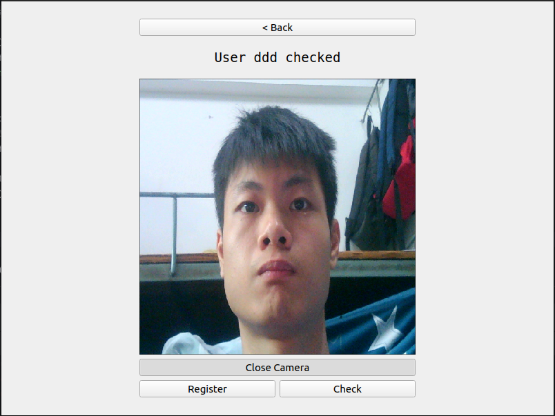

# AttendanceCheck —— 人脸考勤系统


## 前言 Preamble

这个项目是基于我之前的一个同名项目改编而来，原项目地址[链接](https://github.com/JackieCooo/AttendanceCheck)。  
通过将原项目改编成C++项目，可以使其在嵌入式Linux设备中运行。  
> 虽然该项目在功能上与原项目一致，但在软件架构上进行了部分优化，因此运行更稳定。  

This project is based on an adaptation of a previous project of mine with the same name, original project [link](https://github.com/JackieCooo/AttendanceCheck).  
By adapting the original project into a C++ project, it can be made to run in an embedded Linux device.  
> Although this project is functionally the same as the original project, the software architecture has been partially optimized so that it runs more stably.


## 简介 Brief

功能如其名，它是一个用来考勤打卡的桌面小软件。有人脸注册和人脸打卡两个功能，简单易用。  

It functions as the name suggests, it is a small desktop software used to clock in and out. It has two functions, face registration and face clocking, and is easy to use.  

## 编译环境 Compiler Environment

项目使用**Cmake**进行构建，最低版本3.22.1。  
GUI界面使用**Qt5**，人脸识别算法使用**OpenCV**和**dlib**  

The project is built using **Cmake**, minimum version 3.22.1.  
The GUI interface uses **Qt5** and the face recognition algorithm uses **OpenCV** and **dlib**.

## 软件打包 Software Packaging

本项目有Debug和Release两个模式，Debug模式用于编译出适合在主机（虚拟机）运行的可执行文件，可用于调试；Release模式用于编译出适合在嵌入式设备中运行的的可执行文件。  
所以在构建项目前确保自己已经在IDE中配置好两个模式。  
在Debug模式下，只需要在"CMAKE_PREFIX_PATH"中设置Qt5对应的Cmake路径，其余的第三方包通常使用pkg-config进行配置。  
在Release模式下，建议将所有交叉编译好的包放置在同一文件夹，并在"CROSS_LIB_PREFIX"中设置该文件夹路径；然后在"CMAKE_PREFIX_PATH"中设置每个包的Cmake路径。  
``` cmake
if (${CMAKE_BUILD_TYPE} MATCHES "Debug")
    set(CMAKE_PREFIX_PATH /home/jackie/Qt/5.15.2/gcc_64/lib/cmake)
elseif (${CMAKE_BUILD_TYPE} MATCHES "Release")
    set(CROSS_LIB_PREFIX /home/jackie/Tools/Platforms)
    set(CMAKE_PREFIX_PATH
            ${CROSS_LIB_PREFIX}/qt-5.15.2-aarch64/lib/cmake
            ${CROSS_LIB_PREFIX}/opencv-4.8.0-aarch64/lib/cmake
            ${CROSS_LIB_PREFIX}/dlib-19.24-aarch64/lib/cmake
    )
endif ()
```
**要注意在选择不同的模式编译时，也要在IDE中切换至对应的编译工具链。**  
最后执行编译即可编译出可执行文件啦，但要注意的是Release模式下编译出的可执行文件只能在开发板中运行。  

This project has two modes, Debug and Release. Debug mode is used to compile an executable file suitable for running in the host (virtual machine), which can be used for debugging. Release mode is used to compile an executable file suitable for running in the embedded device.  
So make sure you have configured both modes in the IDE before building the project.  
In Debug mode, you only need to set the Cmake path for Qt5 in "CMAKE_PREFIX_PATH", and the rest of the third-party packages are usually configured using pkg-config.  
In Release mode, it is recommended to put all the cross-compiled packages in the same folder, and set the path of the folder in "CROSS_LIB_PREFIX"; then set the Cmake path of each package in "CMAKE_PREFIX_PATH".  
``` cmake
if (${CMAKE_BUILD_TYPE} MATCHES "Debug")
    set(CMAKE_PREFIX_PATH /home/jackie/Qt/5.15.2/gcc_64/lib/cmake)
elseif (${CMAKE_BUILD_TYPE} MATCHES "Release")
    set(CROSS_LIB_PREFIX /home/jackie/Tools/Platforms)
    set(CMAKE_PREFIX_PATH
            ${CROSS_LIB_PREFIX}/qt-5.15.2-aarch64/lib/cmake
            ${CROSS_LIB_PREFIX}/opencv-4.8.0-aarch64/lib/cmake
            ${CROSS_LIB_PREFIX}/dlib-19.24-aarch64/lib/cmake
    )
endif ()
```
**Be aware that when choosing different modes of compilation, you should also switch to the corresponding compilation toolchain in the IDE.**  
Finally, execute the compilation to compile the executable file, but note that the executable file compiled in Release mode can only be run on the development board.

## 如何使用 How to Use

软件启动后点击最下面“Open Camera”按钮打开摄像头（请确保自己的电脑有接入摄像头或自带摄像头）。  
摄像头打开后选择模式，“Register”按钮为人脸注册模式，“Check”按钮为人脸考勤模式。  

Once the software has started, click on the "Open Camera" button at the bottom to open the camera (make sure your computer has access to a camera or comes with one).  
Once the camera is open, select the mode, the "Register" button is for face registration mode and the "Check" button is for face attendance mode.  

### 人脸注册模式 Face registration mode

  
这个模式下摄像头图像周围会有一个框，注册人脸时，必须要使人脸完全在这个框内才会识别成功。  
识别成功后会要求用户输入姓名，点击“OK”按钮后人脸即注册成功。  

In this mode, there will be a box around the camera image. When registering a face, the face must be completely inside this box before the recognition will be successful.  
After a successful recognition, the user will be asked to enter his/her name, and the face will be successfully registered when the "OK" button is clicked.  

### 人脸考勤模式 Face attendance mode

  
在这个模式下，用户将脸对准摄像头，系统成功识别人脸后会在软件上方显示用户的ID和姓名，表示考勤成功。  

In this mode, the user will point his/her face at the camera and the system will display the user's ID and name at the top of the software after the face is successfully recognised, indicating successful attendance.  